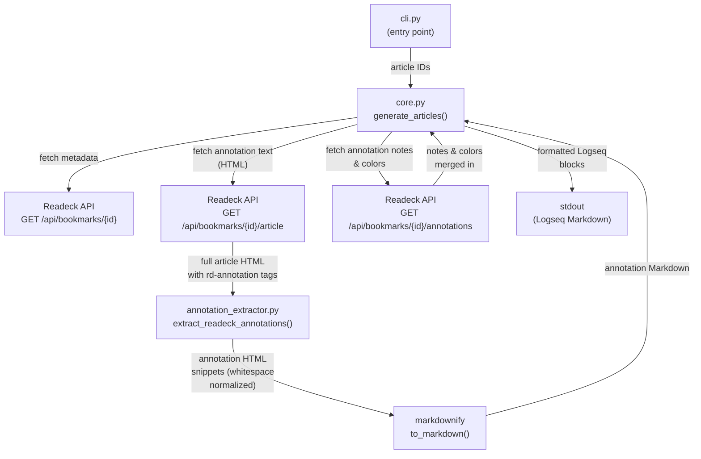

# Architecture

## Overview

`readeck-annotation-export` fetches bookmarks and their annotations from a
[Readeck](https://readeck.org) instance and formats them as
[Logseq](https://logseq.com)-compatible Markdown, ready to paste into a daily
journal page.

## Data flow



### Key modules

| Module | Responsibility |
|---|---|
| `cli.py` | Parses CLI arguments, sets up logging, calls `generate_articles()` |
| `core.py` | Orchestrates API calls, converts HTML to Markdown, formats Logseq output |
| `annotation_extractor.py` | Parses the article's full HTML to extract highlighted spans, using the surrounding tag context to reconstruct well-formed HTML snippets per annotation |

### Annotation extraction detail

Readeck wraps highlighted text in `<rd-annotation>` custom elements inside the
full article HTML.  `ReadeckExtractor` (an `html.parser.HTMLParser` subclass)
walks the document and for each annotation:

1. Records the surrounding tag context (everything between the last `<section>`
   and the annotation).
2. Collects the text content, collapsing whitespace runs outside preformatted
   blocks (`<pre>`, `<code>`) — Readeck's HTML source contains cosmetic
   newlines inside `<p>` tags that would otherwise appear as line breaks in
   the output.
3. Multiple occurrences of the same annotation ID (a single highlight can span
   multiple HTML elements) are merged into one snippet.

The resulting HTML snippets are then converted to Markdown by `markdownify`.

## Running tests

```
uv run --group dev pytest
```

`pytest` is a dev-only dependency managed via uv's dependency groups.  The
command syncs it automatically — no manual venv setup required.  Test paths
are configured in `pyproject.toml` (`testpaths = ["tests"]`).

## Writing tests

Tests live in `tests/` and use the standard `unittest.TestCase` style (picked
up automatically by pytest).

- **`tests/test_annotation_extractor.py`** — unit tests for the HTML parser:
  extraction correctness, context wrapping, entity handling, annotation
  merging, and whitespace normalization.
- **`tests/test_core.py`** — behavioral tests for whitespace normalization
  as seen through `extract_readeck_annotations()`.

For new tests, import directly from the package (not via `src.`):

```python
from readeck_annotation_export.annotation_extractor import extract_readeck_annotations
```
